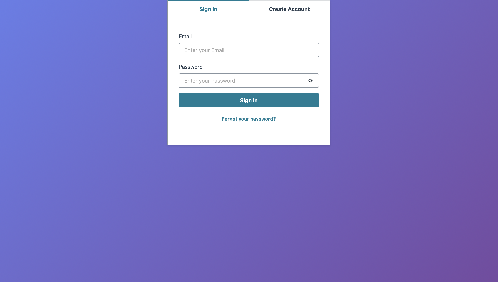
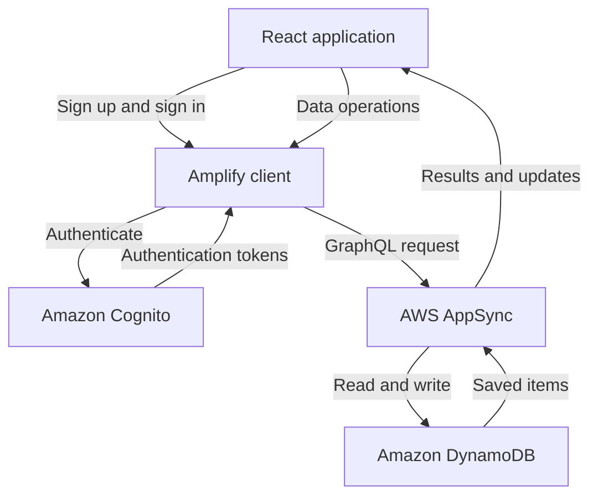

# Bucket List Tracker

A full-stack bucket-list application where users can create an account, sign in, and manage their own personal goals.

Each user’s items are stored securely in the cloud and remain available after refreshing, closing the browser, or signing in from another device.

## Features

- Email-based registration and login
- Secure user authentication
- Add new bucket-list goals
- Mark goals as completed
- Delete goals
- Persistent cloud storage
- Real-time list synchronization
- Private data for each user
- Responsive React interface
- Cloud deployment with AWS Amplify

## Live Demo

[Open the deployed application](https://main.d17ok2d6hqgyy8.amplifyapp.com$0)

## Screenshots

```markdown


```

## Technologies

### Frontend

- **React** - builds the user interface using reusable components
- **Vite** - development server and production build tool
- **CSS** - styles the application
- **Amplify UI React** - provides the authentication interface

### Backend and cloud services

- **AWS Amplify Gen 2** - defines, deploys, and connects the cloud backend
- **Amazon Cognito** - handles registration, login, sessions, and user identity
- **AWS AppSync** - provides the GraphQL API used by the frontend
- **Amazon DynamoDB** - permanently stores bucket-list items
- **AWS Amplify Hosting** - builds and hosts the deployed application

## Architecture



## How It Works

### Authentication

The application uses the Amplify `Authenticator` component. Amazon Cognito creates and authenticates users and returns secure tokens after a successful login.

The frontend includes these tokens when it sends requests to AWS AppSync.

### Data storage

Bucket-list items are stored permanently in Amazon DynamoDB.

The React application communicates with DynamoDB indirectly:

1. React uses the Amplify Data client.
2. Amplify sends a GraphQL request to AWS AppSync.
3. AppSync checks the authenticated user and authorization rules.
4. AppSync reads or writes records in DynamoDB.
5. The result is returned to the React application.

### Per-user data protection

The `Item` data model uses owner-based authorization.

Each item is automatically associated with the Cognito user who created it. AppSync enforces this rule on the backend, ensuring users can only read, update, and delete their own items.

### Real-time synchronization

The application uses Amplify Data’s `observeQuery` operation.

It loads the user’s existing items and listens for changes. When an item is created, updated, or deleted, React receives the latest list and updates the interface.

## Data Model

The primary model is `Item`.

| Field | Type | Description |
|---|---|---|
| `id` | ID | Unique identifier generated by Amplify |
| `title` | String | The bucket-list goal |
| `completed` | Boolean | Whether the goal has been completed |
| `owner` | String | Authenticated user who owns the item |
| `createdAt` | Date/time | Creation timestamp |
| `updatedAt` | Date/time | Last update timestamp |

Amplify automatically manages the ID, owner, and timestamps.

## Project Structure

```text
bucket-list-tracker/
├── amplify/
│   ├── auth/
│   │   └── resource.ts       # Cognito authentication configuration
│   ├── data/
│   │   └── resource.ts       # Data models and authorization
│   └── backend.ts            # Combines backend resources
├── src/
│   ├── assets/               # Images and icons
│   ├── App.jsx               # Main application behavior
│   ├── App.css               # Component styles
│   ├── index.css             # Global styles
│   └── main.jsx              # Amplify and React configuration
├── amplify_outputs.json      # Generated AWS connection settings
├── package.json              # Dependencies and scripts
└── README.md
```

## Running the Project Locally

### Requirements

- Node.js
- npm
- An AWS account
- AWS credentials configured for Amplify development

### Installation

Clone the repository:

```bash
git clone https://github.com/Rusinosul/bucket-list-tracker.git
cd bucket-list-tracker
```

Install the dependencies:

```bash
npm install
```

### Start the Amplify backend

In the first terminal:

```bash
npx ampx sandbox
```

Wait for Amplify to deploy the development backend and generate `amplify_outputs.json`.

### Start the frontend

In a second terminal:

```bash
npm run dev
```

Open the URL displayed by Vite.

## Available Commands

| Command | Purpose |
|---|---|
| `npm run dev` | Starts the Vite development server |
| `npm run build` | Creates a production build |
| `npm run preview` | Previews the production build locally |
| `npm run lint` | Runs ESLint |
| `npx ampx sandbox` | Deploys and watches the development backend |

## Security

Data security is enforced by AppSync using Amplify owner authorization.

The frontend does not download every user’s items and filter them locally. Unauthorized records are blocked by the backend before they can be returned.

Passwords are managed by Amazon Cognito and are not stored or processed by the React application.

## What I Learned

This project helped me learn:

- Building React components with hooks
- Managing temporary UI state with `useState`
- Running side effects and cleanup with `useEffect`
- Creating cloud data subscriptions
- Performing create, read, update, and delete operations
- Authentication versus authorization
- Connecting React to AWS services
- Defining infrastructure as code with Amplify Gen 2
- Persisting user data in DynamoDB
- Building and deploying a full-stack application

## Future Improvements

- Add multiple bucket lists
- Add categories and tags
- Add target completion dates
- Add goal descriptions
- Add filtering and sorting
- Add progress statistics
- Improve mobile responsiveness
- Add automated tests
- Add loading and error states
- Allow users to edit goal titles

## Author

Created by [Rusinosul](https://github.com/Rusinosul).

